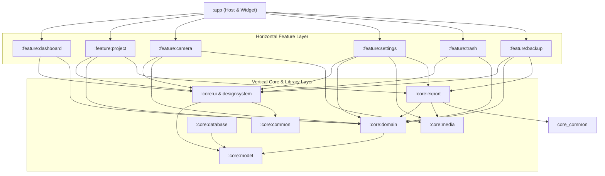

<div align="center">
  <h1>📸 PhotoReport (Elektrik)</h1>
  <p><strong>Next-Generation Android Suite for Field Audits, Technical Inspections & Site Documentation</strong></p>
  
  <p>
    
    
    
    
    
    
    
  </p>
</div>

---

## 🌟 Overview

**PhotoReport** is an enterprise-grade, offline-first mobile inspection and technical documentation platform designed for engineers, field auditors, site supervisors, and project surveyors. Traditional inspection reporting requires tedious post-processing, organizing messy smartphone galleries, and transferring multi-gigabyte media files to desktop software. 

PhotoReport bridges this gap by offering **instantaneous site documentation**—organizing photographic evidence and video logs directly into structured project dossiers, embedding real-time forensic GPS watermarks, utilizing state-of-the-art compression (AVIF & WebP), and exporting comprehensive visual **PDF Reports** and interactive **Web ZIP Archives** on the go.

---

## 🏛️ Enterprise Multi-Module Architecture

PhotoReport follows strict **Clean Architecture** principles and modular decoupling to guarantee scalability, zero build bottlenecks, strict separation of concerns, and extensive automated testability.



### Module Breakdown
* **`:app` (Application Host)**: Lightweight application entry point, AppWidget provider, NavHost navigation orchestration, and root dependency injection container.
* **`:feature:*`**: Highly decoupled, independent feature domains (Dashboard, Project Details, Advanced CameraX Engine, Trash, Backup & Settings). Each feature maintains clean MVVM ViewModel boundaries.
* **`:core:*`**: Foundational libraries providing reusable domain models, Room SQLite abstractions, repository contracts, media image-processing engines, background PDF/ZIP generation workers, and atomic Material 3 Design System components.

---

## 🚀 Key Technical Innovations & Highlights

### 📷 Advanced Custom CameraX Engine
* **Hardware HDR & Zero-Latency Capture**: Custom-engineered CameraX integration that probes physical device capabilities (Level 3, Full, or Legacy) to dynamically enable hardware HDR, Edge High-Quality rendering, and Noise Reduction.
* **Forensic GPS Watermarking**: Automatically captures geographic coordinates, high-precision GPS timestamps, project identifiers, and reverse-geocoded physical street addresses, inscribing a highly legible watermark directly onto captured media.
* **Touch-to-Focus & Exposure Metering**: Smooth exposure compensation control, optical zoom ratio stabilization, grid layout guides, and tap-to-meter precision.

### 🖼️ Next-Gen Media Compression & Storage
* **AVIF & WebP Support**: Features cutting-edge AVIF compression algorithms (lossless & optimized modes) that reduce field report storage usage by up to **75%** compared to traditional legacy JPEGs without sacrificing inspection visual clarity.
* **Smart Garbage Collection & 30-Day Trash**: Accidental deletion protection utilizing soft-deletes and scheduled cleanup tasks to guarantee data safety during remote fieldwork.

### 📄 Pro-Grade Reporting (PDF & HTML-ZIP)
* **Visual Audit PDF Generator**: One-touch creation of paginated, structured technical audit documents featuring company custom logos, formatted project headers, daily timeline breakdowns, and visual evidence notes.
* **Interactive Web Report ZIPs**: For audits involving high-definition inspection video logs, generates an integrated standalone HTML report wrapped inside an optimized ZIP archive for immediate review in any desktop browser.
* **Resilient Background WorkManager**: Heavy export processing runs inside dedicated asynchronous background workers with progress notifications and low-memory fallback safeguards.

### 🌐 Google Play Store & App Bundle (AAB) Hardening
* **Runtime Dynamic Localization**: Native bilingual support (**Türkçe** and **English**) with custom runtime language switching. Configured specifically for Google Play App Bundles (`enableSplit = false`) to guarantee complete resource availability without requiring secondary Play Core network downloads.
* **Universal Hardware Eligibility**: Fully compatible across form factors, tablets, smartphones, and Chromebooks (optional camera hardware declaration).

---

## 🛠️ Technology Stack

| Component | Library / Framework / Tooling |
| :--- | :--- |
| **Language** | Kotlin 2.0+ (Coroutines, Flow, StateFlow, Type-Safe Builders) |
| **UI & Styling** | Jetpack Compose, Material 3 Design System, Custom Tokens, Vector Animations |
| **Architecture** | Clean Architecture, Multi-Module Decoupling, SOLID, Unidirectional Data Flow (UDF) |
| **Dependency Injection** | Dagger Hilt & KSP (Kotlin Symbol Processing) |
| **Local Storage & Database** | Room SQLite Database, Flow-based reactive queries, Foreign-Key cascading |
| **Camera & Image Engine** | CameraX (Core, Camera2, Lifecycle, Video, View, Extensions), Coil 3.x with AVIF |
| **Background Orchestration** | WorkManager with custom foreground notification channels & invalidation monitoring |
| **Build & Tooling** | Gradle Kotlin DSL, Version Catalog (`libs.versions.toml`), ProGuard/R8 optimization |
| **Testing Suite** | JUnit 4, Robolectric, Kotlinx Coroutines Test, Mockito, Automated KSP unit assertions |

---

## ⚡ Quickstart & Build Instructions

### Prerequisites
* **Android Studio**: Ladybug (2024.2.1) or newer recommended.
* **Java Development Kit (JDK)**: JDK 17+.
* **Minimum Android SDK**: Android 11 (API 30).
* **Target Android SDK**: Android 15 (API 37).

### 1. Clone & Setup
```bash
git clone https://github.com/your-username/PhotoReport.git
cd PhotoReport
```

### 2. Verify Build & Execute Automated Tests
Run a full verification sweep across all core and feature modules without installing an APK:
```bash
# Windows
.\gradlew.bat clean testDebugUnitTest

# macOS / Linux
./gradlew clean testDebugUnitTest
```
*All 10 modules feature dedicated unit test suites designed with isolated Fakes and Robolectric runners for sub-second test execution.*

### 3. Generate Debug & Play Store Release Bundles
```bash
# Compile Debug APK
.\gradlew.bat assembleDebug

# Compile production-ready Google Play App Bundle (AAB)
.\gradlew.bat bundleRelease
```
*Compiled APK/AAB outputs will be generated directly inside `app/build/outputs/`.*

---

## 🔒 Offline-First Privacy & Security

PhotoReport operates on a strictly **Offline-First, Zero-Telemetry** architecture:
* No external API tracking keys, cloud analytics, or ad trackers are embedded in the compiled binaries.
* All GPS coordinate extraction, EXIF decoding, video transcoding, and encryption remain strictly local inside device application sandboxes.
* Encrypted local backup archives (`.zip`) allow effortless offline transfer between field tablets and enterprise storage servers.

---

## 📄 License & Legal Notice

Copyright © 2026. Distributed under the **MIT License**. 

See the accompanying `LICENSE` file for distribution rights, modification allowances, and warranty limitations. For enterprise localization or licensing inquiries, please contact the development maintainers.
