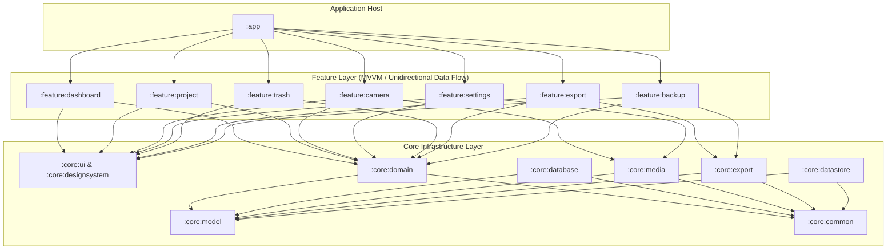

<div align="center">

# PhotoReport

**Turn site photos into structured, audit-ready technical reports.**

An offline-first, multi-module Android platform for field engineers, inspectors, and site supervisors to record photographic evidence, embed forensic watermarks, and generate enterprise PDF and web reports on device.

[](https://kotlinlang.org/)
[](https://developer.android.com/jetpack/compose)
[](https://developer.android.com/topic/architecture)
[](https://github.com/fatih1enes/fotorapor/actions)
[](https://github.com/arturbosch/detekt)
[-34A853?style=flat-square&logo=android&logoColor=white)](https://developer.android.com/about/versions/11)
[](LICENSE)

</div>

---

## About

Traditional site inspection reporting often relies on manual post-processing, messy camera galleries, and labor-intensive desktop document assembly. **PhotoReport** replaces these fragmented steps with a streamlined, mobile-native workflow designed specifically for field conditions.

Operating strictly **offline-first with zero telemetry**, PhotoReport captures photographic evidence and video logs directly into structured project dossiers. It automatically stamps images with physical GPS coordinates, reverse-geocoded addresses, and high-precision timestamps, enabling instant export of paginated PDF audit reports and interactive HTML web archives right on the device.

---

## Key Features

### 📸 Forensic Camera & GPS Watermarking
- **Custom CameraX Engine**: Leverages physical hardware capabilities for HDR capture, tap-to-focus, exposure compensation, and smooth optical zoom.
- **Automatic Watermarking**: Inscribes real-time GPS coordinates, reverse-geocoded street addresses, project identifiers, and exact timestamps directly onto captured media EXIF and visual layers.

### 📂 Dossier & Project Management
- **Structured Workspace**: Organize media by projects, site sub-directories, and daily inspection logs.
- **Reactive Data Engine**: Room SQLite database with reactive `StateFlow` queries ensures instant UI updates and seamless offline persistence.

### 📄 Enterprise Report Generation
- **Native PDF Export**: Generates paginated, formatted technical PDF audit reports with customized headers, site notes, and visual photo grids.
- **Interactive Web Archive (ZIP)**: Exports standalone HTML reports bundled with high-definition inspection videos and photos inside an optimized ZIP archive for immediate desktop review.
- **Background WorkManager**: Asynchronous export execution with real-time foreground notifications and low-memory fallback mechanisms.

### 🛡️ Data Integrity & Protection
- **30-Day Soft-Delete Trash**: Accidental deletion protection with background purge scheduling to guarantee data safety in remote field environments.
- **Full Backup & Restore**: Encrypted ZIP-based archive export and import for seamless offline device migration.

### 🌍 Modern Compose UI & Localization
- **Design System**: Fully responsive edge-to-edge UI crafted with Jetpack Compose, Material 3, and custom design tokens.
- **Bilingual Support**: Dynamic runtime switching between Turkish and English without app restarts.

---

## Architecture

PhotoReport adheres to strict **Clean Architecture** principles and a modular layer architecture, ensuring decoupled feature boundaries, fast incremental builds, and comprehensive testability across 14 dedicated Gradle modules.

```
PhotoReport
├── app/                  # Application Entry Point & Navigation Host
├── baselineprofile/      # Android Baseline Profiles for Startup Optimization
├── core/
│   ├── common/           # Shared Coroutine Dispatchers, Result Wrappers & Utils
│   ├── database/         # Room Database, DAOs & Entities
│   ├── datastore/        # Preferences DataStore for Settings & State
│   ├── designsystem/     # Material 3 Theme Tokens, Typography & Components
│   ├── domain/           # Core Domain Models, Interfaces & Use Cases
│   ├── export/           # PDF Document & HTML/ZIP Report Engines
│   ├── media/            # CameraX Engine, AVIF/WebP Compression & EXIF Tools
│   ├── model/            # Immutable Data Contracts & Value Objects
│   └── ui/               # Common Composables, Modifiers & UI Utilities
└── feature/
    ├── backup/           # System Backup & Restore Feature
    ├── camera/           # CameraX Capture View & Watermark Overlay
    ├── dashboard/        # Main Project Overview & Quick Stats
    ├── export/           # Report Export Wizard & Progress Tracker
    ├── project/          # Project Management & Media Detail View
    ├── settings/         # App Preferences & Localization Settings
    └── trash/            # Soft-Deleted File Recovery & Purge Management
```

### Architectural Dependency Flow



---

## Tech Stack

| Domain | Technology / Library | Version | Purpose |
| :--- | :--- | :--- | :--- |
| **Language** | Kotlin | 2.4+ | Modern, concise language with Coroutines & StateFlow |
| **UI Framework** | Jetpack Compose | Material 3 (BOM 2026+) | Declarative UI framework with custom design system |
| **Dependency Injection** | Dagger Hilt | 2.60+ | Modern Android dependency injection with KSP |
| **Database** | Room SQLite | 2.8+ | Reactive local database abstraction with migration support |
| **Camera & Capture** | CameraX Engine | 1.6+ | Hardware-accelerated camera, HDR capture & video logging |
| **Media Processing** | Coil 3 & AVIF Coder | 3.5+ / 2.2+ | Image caching, WebP & high-efficiency AVIF compression |
| **Background Work** | WorkManager | 2.11+ | Asynchronous background PDF/ZIP export & file cleanup |
| **Video Playback** | Media3 ExoPlayer | 1.10+ | Embedded high-performance inspection video rendering |
| **Code Quality** | Detekt & Ktlint | 1.23+ / 12.1+ | Static code analysis, smell detection & style enforcement |
| **Diagnostics** | LeakCanary | 2.14+ | Automatic memory leak detection in debug builds |
| **Testing** | Robolectric & JUnit 4 | 4.16+ / 4.13+ | Fast unit testing with isolated Android environment fakes |

---

## Code Quality & Engineering Standards

Code quality is a foundational pillar of the PhotoReport codebase. Automated verification tools enforce strict style guidelines, detect potential code smells, and prevent regressions before any code reaches production.

- **Detekt**: Evaluates code complexity, potential bugs, and architectural compliance (`detekt.yml`).
- **Ktlint**: Enforces official Kotlin coding conventions across all modules.
- **Android Lint**: Audits performance, accessibility, and Android API safety.
- **SonarQube**: Standardized code analysis and quality metrics reporter.
- **LeakCanary**: Actively monitors objects for memory leaks during development debug sessions.
- **GitHub Actions**: Continuous integration pipeline that validates every pull request.

### Quality Verification Pipeline

The root project configures a unified `quality` task that executes all quality checks in a single pass:

```bash
# Execute full quality verification suite (Detekt + Ktlint + Android Lint + Unit Tests)
./gradlew quality
```

---

## Quality Commands

| Command | Platform | Description |
| :--- | :--- | :--- |
| `./gradlew quality` | All | Executes all quality tasks (Detekt, Ktlint, Lint, Unit Tests) |
| `./gradlew detekt` | All | Runs static code analysis for code smells & complexity |
| `./gradlew ktlintCheck` | All | Verifies Kotlin style compliance against project rules |
| `./gradlew ktlintFormat` | All | Automatically formats Kotlin source code to meet style standards |
| `./gradlew lint` | All | Performs Android Lint checks across all subprojects |
| `./gradlew testDebugUnitTest` | All | Runs unit test suites across all core and feature modules |
| `./gradlew assembleDebug` | All | Compiles the debug APK binary (`app/build/outputs/apk/debug/`) |
| `./gradlew bundleRelease` | All | Compiles production Play Store App Bundle (`app/build/outputs/bundle/release/`) |

*On Windows PowerShell, replace `./gradlew` with `.\gradlew.bat`.*

---

## Setup & Development

### Prerequisites

- **Android Studio**: Ladybug (2024.2.1) or newer
- **JDK**: Java Development Kit 17+
- **Minimum SDK**: Android 11 (API level 30)
- **Target SDK**: Android 15 (API level 35+)

### Local Environment Setup

1. **Clone the Repository**
   ```bash
   git clone https://github.com/fatih1enes/fotorapor.git
   cd fotorapor
   ```

2. **Configure Signing Keys**
   Copy the template property file for local signing configuration:
   ```bash
   # Windows PowerShell
   Copy-Item keystore.properties.example keystore.properties

   # Linux / macOS
   cp keystore.properties.example keystore.properties
   ```

3. **Verify the Project**
   Run quality checks and compile the debug APK to verify your setup:
   ```bash
   # Windows PowerShell
   .\gradlew.bat quality assembleDebug

   # Linux / macOS
   ./gradlew quality assembleDebug
   ```

---

## Project Status

- **Current Version**: `v2.0.1`
- **Architecture**: Modular Clean Architecture (v2)
- **Privacy & Security**: 100% Offline-First, Zero-Telemetry, No Third-Party Analytics Trackers.

---

## Roadmap

- [ ] Custom PDF report layout templates & logo branding configuration
- [ ] Direct EXIF tag editing & custom field notes customization
- [ ] Self-hosted storage sync adapters (S3 / WebDAV) for enterprise teams

---

## Contributing

Contributions are welcome! Please read [CONTRIBUTING.md](CONTRIBUTING.md) for details on our code of conduct, branching strategy, and pull request checklist.

---

## License

Distributed under the **MIT License**. See [`LICENSE`](LICENSE) for complete terms and copyright details.

---

<div align="center">
  <sub>Built with Kotlin & Jetpack Compose • Designed for Field Engineers</sub>
</div>
